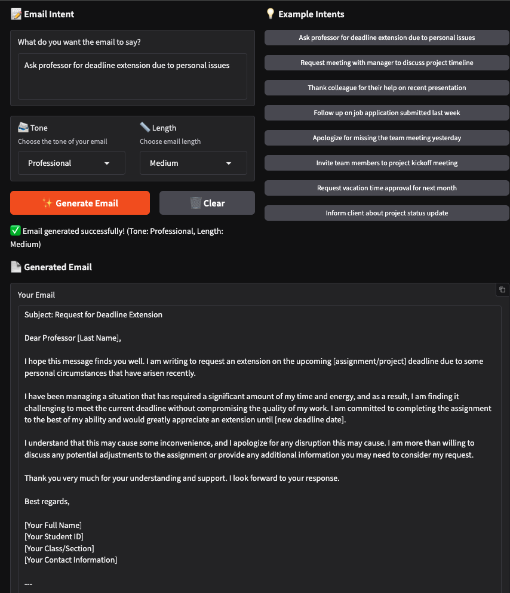
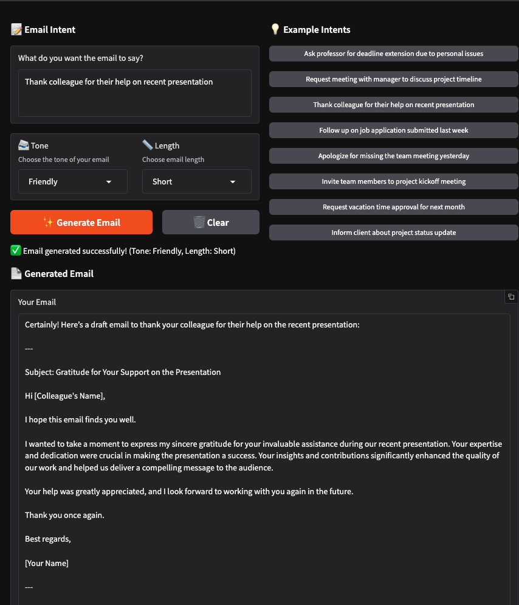

# LLM Email Autowriter 🚀


> **Generate professional, personalized emails in seconds using state-of-the-art AI.**

---

[](LICENSE)
[](https://www.python.org/downloads/)
[](Dockerfile)

---

## Table of Contents
- [Overview](#overview)
- [Features](#features)
- [Demo](#demo)
- [Getting Started](#getting-started)
- [Configuration](#configuration)
- [Usage](#usage)
  - [Gradio UI](#gradio-ui)
  - [API](#api)
- [Troubleshooting & FAQ](#troubleshooting--faq)


---

## Overview

**LLM Email Autowriter** is an open-source application that leverages powerful language models (like Qwen or Mistral via vLLM) to help you craft well-structured, context-aware emails. Whether you need a quick reply, a formal request, or a friendly follow-up, just describe your intent and let the AI do the rest!

---

## Features

- ✉️ **AI-Powered Email Generation**: Instantly generate emails tailored to your intent, tone, and length.
- ⚡ **FastAPI Backend**: Robust RESTful API with `/generate` endpoint for seamless integration.
- 🎨 **Gradio Frontend**: User-friendly web UI for real-time email creation.
- 🧠 **vLLM Integration**: Supports efficient inference with local LLMs (Qwen, Mistral, etc.).
- 🛠️ **Modular Architecture**: Clean separation of API, model, and UI for easy maintenance.
- 🐳 **Dockerized**: Ready-to-run with Docker for consistent environments.
- ☁️ **Lightning AI Cloud Support**: Deploy effortlessly to the cloud.
- 🔒 **Configurable & Secure**: Manage settings via `.env` and environment variables.

---

## Demo

> **Try it locally or deploy to the cloud!**

<p align="center">
  
  <br>
  <em>Main Gradio UI: Enter your intent, select tone and length, and generate your email instantly.</em>
</p>

<p align="center">
  
  <br>
  <em>Example of a generated email output using the app.</em>
</p>

---

## Getting Started

### Prerequisites
- Python 3.10+
- GPU (recommended for Qwen 7B or similar models)
- [Lightning AI](https://lightning.ai/) account (for cloud deployment)
- Docker (for containerized/local deployment)

### Installation

1. **Clone the repository**
    ```bash
    git clone https://github.com/MGhassanCs/llm-email-autowriter.git
    cd llm_email_autowriter
    ```
2. **Create a virtual environment**
    ```bash
    python -m venv env
    source env/bin/activate  # or `env\Scripts\activate` on Windows
    ```
3. **Install dependencies**
    ```bash
    pip install -r requirements.txt
    ```
4. **Run the application**
    - **Lightning AI (Cloud)**
      ```bash
      lightning run app lightning_app.py --cloud
      ```
    - **Local Development**
      ```bash
      python local_dev.py
      ```
    - **Docker (Optional)**
      ```bash
      docker build -t llm-email-autowriter .
      docker run -p 7860:7860 llm-email-autowriter
      ```

---

## Configuration

All environment variables are managed via the `.env` file:

| Variable      | Description                                 | Example           |
|---------------|---------------------------------------------|-------------------|
| ENVIRONMENT   | Set to `development` or `production`        | development       |
| DEBUG         | Enable debug mode (`true` or `false`)       | true              |
| MODEL_NAME    | Model to use for generation                 | Qwen/Qwen-7B      |
| VLLM_HOST     | Host where vLLM is running                  | 127.0.0.1         |
| VLLM_PORT     | Port for vLLM                               | 8000              |

---

## Usage

### Gradio UI
- Launch the app and open your browser to `http://localhost:7860` (or the provided URL).
- Enter your email intent, select tone and length, and click **Generate**.

### API
- **Endpoint:** `POST /generate`
- **Parameters:**
  - `intent` (string): The purpose or content of your email
  - `tone` (string): Email tone (`Professional`, `Friendly`, `Formal`, `Casual`, `Polite`)
  - `length` (string): Email length (`Short`, `Medium`, `Long`)

#### Example Request
```bash
curl -X POST http://localhost:8000/generate \
  -H "Content-Type: application/json" \
  -d '{"intent": "Request a meeting with the team", "tone": "Professional", "length": "Short"}'
```

#### Example Response
```json
{
  "email": "Dear Team,\n\nI would like to schedule a meeting to discuss our upcoming project milestones. Please let me know your availability.\n\nBest regards,\n[Your Name]"
}
```

---

## Troubleshooting & FAQ

- **Q: The model is slow or not responding?**
  - A: Ensure you have a compatible GPU and the model is downloaded. Check logs for errors.
- **Q: How do I change the model?**
  - A: Update `MODEL_NAME` in your `.env` file and restart the app.
- **Q: Can I deploy this on the cloud?**
  - A: Yes! Use Lightning AI for seamless cloud deployment.
- **Q: Where are logs stored?**
  - A: Logs are output to the console by default.

---


## Recommended: Deploying on the Cloud with GitHub & Lightning AI

To run your own instance of LLM Email Autowriter on the cloud (Lightning AI), follow these steps:

### 1. Fork This Repository
- Click the **Fork** button at the top right of the [GitHub repo](https://github.com/MGhassanCs/llm-email-autowriter).
- This creates your own copy under your GitHub account, so you can make changes and deploy independently.

### 2. Clone Your Fork Locally (Optional)
If you want to customize the app before deploying:
```bash
git clone https://github.com/<your-username>/llm-email-autowriter.git
cd llm-email-autowriter
```
Make your changes, then:
```bash
git add .
git commit -m "Your customizations"
git push origin main
```

### 3. Deploy on Lightning AI (Cloud)
- Go to [Lightning AI](https://lightning.ai/)
- Start a new app and select **GitHub** as your code source
- Paste your fork URL: `https://github.com/<your-username>/llm-email-autowriter.git`
- Follow the Lightning AI instructions to launch your app in the cloud

### 4. Update Your Cloud App
Whenever you make changes locally, push them to your fork on GitHub. Lightning AI will pull the latest code from your repository when you redeploy or restart your app.

### 5. Keeping Your Fork Up to Date (Optional)
To get updates from the original project:
```bash
git remote add upstream https://github.com/MGhassanCs/llm-email-autowriter.git
git fetch upstream
git merge upstream/main
```

---

> **Note:** You do not need to submit pull requests or contribute back unless you want to. This workflow is for running your own cloud instance with your customizations.

---